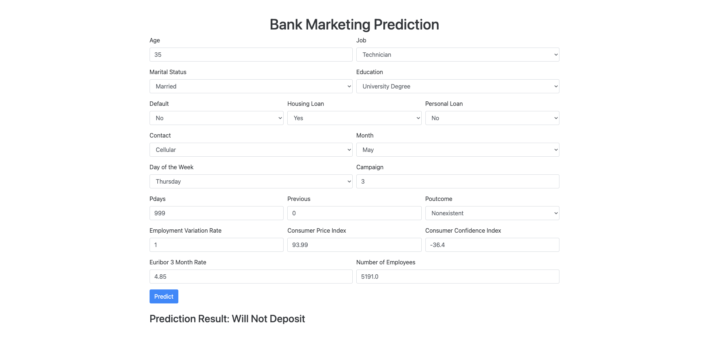

# Bank Marketing Prediction Project

## Overview
This project aims to predict whether a client will subscribe to a bank term deposit based on various client and campaign attributes. It utilizes machine learning techniques to analyze a dataset enriched with social and economic context attributes.

## Objective
The goal of the project is to build a predictive model that can accurately predict whether a client will subscribe to a term deposit, helping banks optimize their telemarketing campaigns.

## Technologies Used
- Python
- Libraries: Pandas, NumPy, Scikit-learn, XGBoost
- Jupyter Notebook for data exploration and model development

## Citation
If you use this dataset, please cite:
[Moro et al., 2014] S. Moro, P. Cortez and P. Rita. A Data-Driven Approach to Predict the Success of Bank Telemarketing. Decision Support Systems, In press, http://dx.doi.org/10.1016/j.dss.2014.03.001

## Dataset
The dataset used in this project is based on the Bank Marketing UCI dataset, enhanced with additional social and economic features. It is available at: [Bank Marketing Dataset](http://archive.ics.uci.edu/ml/datasets/Bank+Marketing)

## Project Structure

## Results
- Achieved predictive accuracy and other metrics will be summarized.
- Insights gained from the analysis will be discussed.

## Contributing
Contributions are welcome. If you find any issues or have suggestions for improvements, please create an issue or submit a pull request.
